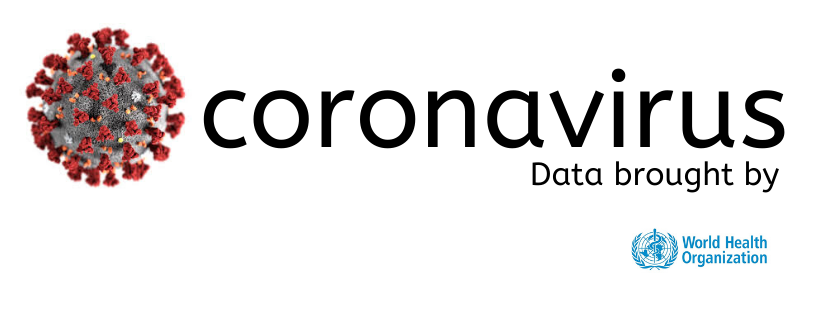

# **🐛 COVID19** (version 1.1.8)


          


[](https://travis-ci.com/ChrisMichaelPerezSantiago/covid19)

 <a href="https://nodei.co/npm/covid19-api/"></a>


> This API provides updated real-time data on coronavirus cases from the worldometers page and other important websites, provided by the most reputable organizations and statistical offices in the world.

---

 <p align="center"> 
  
</p> 

## 🚨 Important Information 🚨
*If you notice that I make and publish many updates / versions in the api, it is due to all the data that is reaching the public. This helps me create a more complete API, with accurate data.*

*In turn, I have created a [website](https://covid19pr.chrismichael.now.sh/) to demonstrate the capabilities that this API has when using it to create web applications. I have only created it for demonstration, so it will serve as a prototype.*

*Sorry for the inconvenience!*


## API URL
- [x] [COVID19 API URL now.sh](https://covid19-server.chrismichael.now.sh/api/v1/)

## 📝 Brief Information on COVID19


**How dangerous is the virus?**
*There are three parameters to understand in order to assess the magnitude of the risk posed by this novel coronavirus:*

- [x] [Transmission Rate (Ro)](https://www.worldometers.info/coronavirus/#repro) - number of newly infected people from a single case
- [x] [Case Fatality Rate (CFR)](https://www.worldometers.info/coronavirus/coronavirus-death-rate/) - percent of cases that result in death
- [x] Determine whether [asymptomatic transmission](https://www.worldometers.info/coronavirus/coronavirus-incubation-period/#asy) is possible

**How contagious is the COVID19? (Ro)**
*The attack rate or transmissibility (how rapidly the disease spreads) of a virus is indicated by its reproductive number (Ro, pronounced R-nought or r-zero), which represents the average number of people to which a single infected person will transmit the virus.*

- [x] WHO's estimated (on Jan. 23) Ro to be between `1.4` and `2.5`.
- [x] Other studies have estimated a Ro between `3.6` and `4.0`, and between `2.24` to `3.58`.
- [x] Preliminary studies had estimated Ro to be between `1.5` and `3.5`.
- [x] An outbreak with a reproductive number of below `1` will gradually disappear.
- [x] For comparison, the Ro for the common flu is `1.3` and for SARS it was `2.0`.

**Fatality Rate (case fatality ratio or CFR) of the COVID19**
*See full details:* [COVID19 Fatality Rate](https://www.worldometers.info/coronavirus/coronavirus-death-rate/)

*The novel coronavirus' case fatality rate has been estimated at around `2%`, in the WHO press conference held on January 29, 2020 . However, it noted that, without knowing how many were infected, it was too early to be able to put a percentage on the mortality rate figure.*

- [x] A prior estimate had put that number at `3%`.
- [x] Fatality rate can change as a virus can mutate, according to epidemiologists.
- [x] For comparison, the case fatality rate for SARS was `10%`, and for MERS `34%`.

**Incubation Period (how long it takes for symptoms to appear)**
*See full details:* [COVID-19 Coronavirus Incubation Period](https://www.worldometers.info/coronavirus/coronavirus-incubation-period/)

*Symptoms of the novel coronavirus (2019-nCoV) may appear in as few as `2` days or as long as `14` (estimated ranges vary from `2-10` days, `2-14` days, and `10-14` days, [see details](https://www.worldometers.info/coronavirus/coronavirus-incubation-period/)), during which the virus is contagious but the patient does not display any symptom (asymptomatic transmission).*


## 🎉 COVID19 API - UPDATED v1.1.8
- [x] *Download report of all cases confirmed by each country in CSV format provided by the **worldometers** website*
  - `downloadReportsToCSV()`


## 📖 API Documentation

### PluginManager.getReports()
*Confirmed Cases and Deaths(GLOBAL)*

```json
[
  [
    {
      "cases": 737373,
      "deaths": 898546,
      "recovered": 76618,
      "active_cases": [
        {
          "currently_infected_patients": -237791,
          "inMidCondition": -243712,
          "criticalStates": 5921
        }
      ],
      "closed_cases": [
        {
          "cases_which_had_an_outcome": 975164,
          "recovered": 76618,
          "deaths": 898546
        }
      ],
      "table": [
        [
          {
            "Country,Other": "China",
            "TotalCases": "80,851",
            "NewCases": "+7",
            "TotalDeaths": "3,199",
            "NewDeaths": "",
            "TotalRecovered": "66,934",
            "ActiveCases": "10,718",
            "Serious,Critical": "3,226",
            "Tot Cases/1M pop": "56.2"
          },
          {
            "Country,Other": "Vatican City",
            "TotalCases": "568,000",
            "NewCases": "+567,999",
            "TotalDeaths": "892,045",
            "NewDeaths": "+892,045",
            "TotalRecovered": "",
            "ActiveCases": "-324,045",
            "Serious,Critical": "",
            "Tot Cases/1M pop": ""
          },
          {
            "Country,Other": "Italy",
            "TotalCases": "24,747",
            "NewCases": "+3,590",
            "TotalDeaths": "1,809",
            "NewDeaths": "+368",
            "TotalRecovered": "2,335",
            "ActiveCases": "20,603",
            "Serious,Critical": "1,672",
            "Tot Cases/1M pop": "409.3"
          },
          {
            "Country,Other": "Iran",
            "TotalCases": "13,938",
            "NewCases": "+1,209",
            "TotalDeaths": "724",
            "NewDeaths": "+113",
            "TotalRecovered": "4,590",
            "ActiveCases": "8,624",
            "Serious,Critical": "",
            "Tot Cases/1M pop": "165.9"
          },
          {
            "Country,Other": "S. Korea",
            "TotalCases": "8,162",
            "NewCases": "+76",
            "TotalDeaths": "75",
            "NewDeaths": "+3",
            "TotalRecovered": "834",
            "ActiveCases": "7,253",
            "Serious,Critical": "59",
            "Tot Cases/1M pop": "159.2"
          },
          {
            "Country,Other": "Spain",
            "TotalCases": "7,845",
            "NewCases": "+1,454",
            "TotalDeaths": "292",
            "NewDeaths": "+96",
            "TotalRecovered": "517",
            "ActiveCases": "7,036",
            "Serious,Critical": "272",
            "Tot Cases/1M pop": "167.8"
          },
          {
            "Country,Other": "Germany",
            "TotalCases": "5,813",
            "NewCases": "+1,214",
            "TotalDeaths": "11",
            "NewDeaths": "+2",
            "TotalRecovered": "46",
            "ActiveCases": "5,756",
            "Serious,Critical": "2",
            "Tot Cases/1M pop": "69.4"
          },
          {
            "Country,Other": "France",
            "TotalCases": "5,423",
            "NewCases": "+924",
            "TotalDeaths": "127",
            "NewDeaths": "+36",
            "TotalRecovered": "12",
            "ActiveCases": "5,284",
            "Serious,Critical": "400",
            "Tot Cases/1M pop": "83.1"
          },
          {
            "Country,Other": "USA",
            "TotalCases": "3,680",
            "NewCases": "+737",
            "TotalDeaths": "68",
            "NewDeaths": "+11",
            "TotalRecovered": "59",
            "ActiveCases": "3,553",
            "Serious,Critical": "10",
            "Tot Cases/1M pop": "11.1"
          },
          // .....
        ]
      ]
    }
  ]
]
```


### PluginManager.getReportsByCountries([country])
*Confirmed Cases and Deaths by Country*

***Table List (params) Last update***: 04/4/2020

| Countries     |
| ------------- |
|afghanistan, albania, algeria, andorra, angola, anguilla, antigua-and-barbuda, argentina, armenia, aruba, australia, austria, azerbaijan|
|bahamas, bahrain, bangladesh, barbados, belarus, belgium, belize, benin, bermuda, bhutan, bolivia, bosnia-and-herzegovina, botswana, brazil, british-virgin-islands, brunei-darussalam, bulgaria, burkina-faso, burundi|
|cabo-verde, cambodia, cameroon, canada, caribbean-netherlands, cayman-islands, central-african-republic, chad, channel-islands, chile, china, china-hong-kong-sar, china-macao-sar, colombia, congo, costa-rica, cote-d-ivoire, croatia, cuba, curacao, cyprus, czech-republic|
|democratic-republic-of-the-congo, denmark, djibouti, dominica, dominican-republic|
|ecuador, egypt, el-salvador, equatorial-guinea, eritrea, estonia, ethiopia|
|faeroe-islands, falkland-islands-malvinas, fiji, finland, france, french-guiana, french-polynesia|
|gabon, gambia, georgia, germany, ghana, gibraltar, greece, greenland, grenada, guadeloupe, guatemala, guinea, guinea-bissau, guyana|
|haiti, holy-see, honduras, hungary|
|iceland, india, indonesia, iran, iraq, ireland, isle-of-man, israel, italy|
|jamaica, japan, jordan|
|kazakhstan, kenya, kuwait, kyrgyzstan|
|laos, latvia, lebanon, liberia, libya, liechtenstein, lithuania, luxembourg|
|macedonia, madagascar, malawi, malaysia, maldives, mali, malta, martinique, mauritania, mauritius, mayotte, mexico, moldova, monaco, mongolia, montenegro, montserrat, morocco, mozambique, myanmar|
|namibia, nepal, netherlands, new-caledonia, new-zealand, nicaragua, niger, nigeria, norway|
|oman|
|pakistan, panama, papua-new-guinea, paraguay, peru, philippines, poland, portugal|
|qatar|
|reunion, romania, russia, rwanda|
|saint-barthelemy, saint-kitts-and-nevis, saint-lucia, saint-martin, saint-vincent-and-the-grenadines, san-marino, saudi-arabia, senegal, serbia, seychelles, sierra-leone, singapore, sint-maarten, slovakia, slovenia, somalia, south-africa, south-korea, spain, sri-lanka, state-of-palestine, sudan, suriname, swaziland, sweden, switzerland, syria|
|taiwan, tanzania, thailand, timor-leste, togo, trinidad-and-tobago, tunisia, turkey, turks-and-caicos-islands|
|uganda uk ukraine united-arab-emirates uruguay us uzbekistan|
|venezuela, viet-nam|
|zambia, zimbabwe|


```json
[
  [
    {
      "country": "us",
      "flag": "https://www.worldometers.info/img/flags/small/tn_us-flag.gif",
      "cases": 3680,
      "deaths": 68,
      "recovered": 59,
      "active_cases": [
        {
          "currently_infected_patients": 3553,
          "inMidCondition": 3543,
          "criticalStates": 10
        }
      ],
      "closed_cases": [
        {
          "cases_which_had_an_outcome": 127,
          "recovered": 59,
          "deaths": 68
        }
      ]
    }
  ]
]
```

### PluginManager.getDeaths();
*Total Deaths of Novel Coronavirus (2019-nCoV)*

```json
[
  [
    {
      "deaths": 898546,
      "table": [
        {
          "Date": "Mar. 14",
          "Total Deaths": "5,833",
          "Change in Total": "404",
          "Change in  Total (%)": "7%"
        },
        {
          "Date": "Mar. 13",
          "Total Deaths": "5,429",
          "Change in Total": "448",
          "Change in  Total (%)": "9%"
        },
        {
          "Date": "Mar. 12",
          "Total Deaths": "4,981",
          "Change in Total": "353",
          "Change in  Total (%)": "8%"
        },
        {
          "Date": "Mar. 11",
          "Total Deaths": "4,628",
          "Change in Total": "332",
          "Change in  Total (%)": "8%"
        },
        {
          "Date": "Mar. 10",
          "Total Deaths": "4,296",
          "Change in Total": "271",
          "Change in  Total (%)": "7%"
        },
        // .....
      ]
    }
  ]
]
```

## PluginManager.getSituationReports()
*Coronavirus disease (COVID-2019) situation reports*

```json
[
  [
    {
      report: 'Situation report - 55',
      date: ' 15 March 2020',
      pdf: 'https://www.who.int/docs/default-source/coronaviruse/situation-reports/20200315-sitrep-55-covid-19.pdf?sfvrsn=33daa5cb_8'
    },
    {
      report: 'Situation report - 54',
      date: ' 14 March 2020',
      pdf: 'https://www.who.int/docs/default-source/coronaviruse/situation-reports/20200314-sitrep-54-covid-19.pdf?sfvrsn=dcd46351_8'
    },
    {
      report: 'Situation report - 53',
      date: ' 13 March 2020',
      pdf: 'https://www.who.int/docs/default-source/coronaviruse/situation-reports/20200313-sitrep-53-covid-19.pdf?sfvrsn=adb3f72_2'
    },
    {
      report: 'Situation report - 52',
      date: ' 12 March 2020',
      pdf: 'https://www.who.int/docs/default-source/coronaviruse/situation-reports/20200312-sitrep-52-covid-19.pdf?sfvrsn=e2bfc9c0_4'
    },
    {
      report: 'Situation report - 51',
      date: ' 11 March 2020',
      pdf: 'https://www.who.int/docs/default-source/coronaviruse/situation-reports/20200311-sitrep-51-covid-19.pdf?sfvrsn=1ba62e57_10'
    },
    {
      report: 'Situation report - 50',
      date: ' 10 March 2020',
      pdf: 'https://www.who.int/docs/default-source/coronaviruse/situation-reports/20200310-sitrep-50-covid-19.pdf?sfvrsn=55e904fb_2'
    },
    // .....
  ]
]
```


### PluginManager.getTaskForceInfoUS()
*From the White House Coronavirus Task Force*
  - *What every American and community can do now to decrease the spread of the coronavirus*
  - *Recommendations for 30-Day Mitigation Strategies*

```json
[
  [
    {
      state: 'Keeping workplaces, homes, schools, or commercial establishments safe',
      pdf: 'https://www.cdc.gov/coronavirus/2019-ncov/downloads/workplace-school-and-home-guidance.pdf'
    },
    {
      state: 'CDC’s framework for mitigation',
      pdf: 'https://www.cdc.gov/coronavirus/2019-ncov/downloads/community-mitigation-strategy.pdf'
    },
    {
      state: 'Florida',
      pdf: 'https://www.cdc.gov/coronavirus/2019-ncov/downloads/FL_Community_Mitigation.pdf'
    },
    {
      state: 'Massachusetts',
      pdf: 'https://www.cdc.gov/coronavirus/2019-ncov/downloads/MA_Community_Mitigation.pdf'
    },
    {
      state: 'New Rochelle, NY',
      pdf: 'https://www.cdc.gov/coronavirus/2019-ncov/downloads/New-Rochelle_Community_Mitigation.pdf'
    },
    {
      state: 'Santa Clara, CA',
      pdf: 'https://www.cdc.gov/coronavirus/2019-ncov/downloads/Santa-Clara_Community_Mitigation.pdf'
    },
    {
      state: 'Seattle, WA',
      pdf: 'https://www.cdc.gov/coronavirus/2019-ncov/downloads/Seattle_Community_Mitigation.pdf'
    }
  ]
]
```

### PluginManager.getGlobalData();
- *Public data of each country, with updated data in real time.*
  - *The problem with this function is that the data takes a little time to display, this is due to the large amount of data that is added to [COVID-19 google spreadsheets](https://docs.google.com/spreadsheets/d/1avGWWl1J19O_Zm0NGTGy2E-fOG05i4ljRfjl87P7FiA/htmlview?ts=5e5e9222&sle=true#gid=0).*
  - *According to information it is possible that the data is moved due to the large amount of data on the page. Eventually any changes I will be aware of.*
  - *Since the data is not well parsed I leave you a table referencing the properties:*
  - | Object Properties      | 
    | ---------------------- |
    |A = Province/State      |
    |B =  date               |
    |C = Case Type           |
    |D = Cases               |
    |E = Long                |
    |F = Lat                 |
    |D = Difference          |
    |H = Last Update Date    |

```json
  {
    "53065": "Argentina",
    "A": "",
    "B": "2020-03-15",
    "C": "Confirmed",
    "D": "45",
    "E": "-63.6167",
    "F": "-38.4161",
    "G": "11",
    "H": "2020-03-16 12:08:25"
  },  
  {
    "53065": "Armenia",
    "A": "",
    "B": "2020-01-22",
    "C": "Confirmed",
    "D": "0",
    "E": "45.0382",
    "F": "40.0691",
    "G": "0",
    "H": "2020-03-16 12:08:25"
  },
```

### PluginManager.getTestsInUS()
*Reporting public health labs are 48 state public health labs (AK, AL, AR, AZ, CA, CO, CT, DE, FL, GA, HI, IA, ID, IL, IN, KS, KY, LA, MA, MD, ME, MI, MN, MO, MS, MT, NC, ND, NE, NH, NJ, NM, NV, NY, OH, OK, OR, PA, RI, SC, SD, TN, TX, VT, WA, WI, WV and WY), New York City, USAF, and 9 California counties.*
 - *Non-respiratory specimens were excluded. For state public health labs, the date represents the date of sample collection, if available, or the date tested. For CDC labs, the date represents the date specimen was received at CDC.*
 - *[Centers for Disease Control and Prevention Testing in U.S. ](https://www.cdc.gov/coronavirus/2019-ncov/cases-updates/testing-in-us.html)*

```json
[
  [
    // .....
    {
      'Date Collected': '3/10',
      'CDC Labs': '139',
      'US Public Health Labs': '2567'
    },
    {
      'Date Collected': '3/11',
      'CDC Labs': '107',
      'US Public Health Labs': '2637'
    },
    {
      'Date Collected': '3/12',
      'CDC Labs': '75‡',
      'US Public Health Labs': '2302‡'
    },
    {
      'Date Collected': '3/13',
      'CDC Labs': '0‡',
      'US Public Health Labs': '1511‡'
    },
    {
      'Date Collected': '3/14',
      'CDC Labs': '0‡',
      'US Public Health Labs': '165‡'
    },
    {
      'Date Collected': '3/15',
      'CDC Labs': '0‡',
      'US Public Health Labs': '4‡'
    }
  ]
]
```

## Age, Sex, Existing Conditions of COVID-19 Cases and Deaths

### PluginManager.getFatalityRateByAge()
- ***Age of Coronavirus Deaths - COVID-19 Fatality Rate by AGE***
  - *`Death Rate` = (number of deaths / number of cases) = `probability of dying if infected by the virus` (%). This probability differs depending on the age group. The percentages shown below `do not have to add up to 100%`, as they `do NOT represent share of deaths by age` group. Rather, it represents, for a person in a given age group, the `risk of dying` if infected with COVID-19.*
  - **`Death Rate` = (number of deaths / number of cases) = `probability of dying if infected by the virus` (%). The percentages do not have to add up to 100%, as they `do NOT represent share of deaths by age` group.*

```json
[
  [
    {
      '0': 'AGE',
      '1': 'DEATH RATE confirmed cases',
      '2': 'DEATH RATE all cases'
    },
    { '0': '80+ years old', '1': '21.9%', '2': '14.8%' },  
    { '0': '70-79 years old', '1': '', '2': '8.0%' },      
    { '0': '60-69 years old', '1': '', '2': '3.6%' },      
    { '0': '50-59 years old', '1': '', '2': '1.3%' },      
    { '0': '40-49 years old', '1': '', '2': '0.4%' },      
    { '0': '30-39 years old', '1': '', '2': '0.2%' },      
    { '0': '20-29 years old', '1': '', '2': '0.2%' },      
    { '0': '10-19 years old', '1': '', '2': '0.2%' },      
    { '0': '0-9 years old', '1': '', '2': 'no fatalities' }
  ]
]
```

### PluginManager.getFatalityRateBySex()
- ***Sex ratio - COVID-19 Fatality Rate by SEX***
  - *`Death Rate` = (number of deaths / number of cases) = `probability of dying if infected by the virus` (%). This probability differs depending on sex. When reading these numbers, it must be taken into account that `smoking` in China is much more prevalent among males. Smoking increases the risks of respiratory complications.*
  - *`Death Rate` = (number of deaths / number of cases) = `probability of dying if infected by the virus` (%). The percentages `do not have to add up to 100%`, as they `do NOT represent share of deaths by sex.`*

```json
[
  [
    {
      '0': 'SEX',
      '1': 'DEATH RATE confirmed cases',
      '2': 'DEATH RATE all cases'
    },
    { '0': 'Male', '1': '4.7%', '2': '2.8%' },
    { '0': 'Female', '1': '2.8%', '2': '1.7%' }
  ]
]
```
## Pre-existing medical conditions (comorbidities)
*Patients who reported no pre-existing ("comorbid") medical conditions had a case fatality rate of 0.9%. Pre-existing illnesses that put patients at higher risk of dying from a COVID-19 infection are:*

### PluginManager.getFatalityRateByComorbidities()
 - *COVID-19 Fatality Rate by COMORBIDITY*
   - *`Death Rate` = (number of deaths / number of cases) = `probability of dying if infected by the virus` (%). This probability differs depending on pre-existing condition. The percentage shown below does `NOT represent in any way the share of deaths by pre-existing condition. Rather, it represents, for a patient with a given pre-existing condition`, the `risk of dying` if infected by COVID-19.*

```json
[
  [
    {
      '0': 'PRE-EXISTING CONDITION',
      '1': 'DEATH RATE confirmed cases',
      '2': 'DEATH RATE all cases'
    },
    { '0': 'Cardiovascular disease', '1': '13.2%', '2': '10.5%' },
    { '0': 'Diabetes', '1': '9.2%', '2': '7.3%' },
    { '0': 'Chronic respiratory disease', '1': '8.0%', '2': '6.3%' },
    { '0': 'Hypertension', '1': '8.4%', '2': '6.0%' },
    { '0': 'Cancer', '1': '7.6%', '2': '5.6%' },
    { '0': 'no pre-existing conditions', '1': '', '2': '0.9%' }
  ]
]
```

## Countries where COVID-19 has spread
### PluginManager.getCountriesWhereCoronavirusHasSpread();
*The 177 countries where COVID-19 has spread and reported*

```json
[
  [
    {
      "Country": "China",
      "Cases": "80,928",
      "Deaths": "3,245",
      "Region": "Asia"
    },
    {
      "Country": "Italy",
      "Cases": "35,713",
      "Deaths": "2,978",
      "Region": "Europe"
    },
    {
      "Country": "Iran",
      "Cases": "18,407",
      "Deaths": "1,284",
      "Region": "Asia"
    },
    {
      "Country": "Spain",
      "Cases": "17,147",
      "Deaths": "767",
      "Region": "Europe"
    },
    {
      "Country": "Germany",
      "Cases": "13,632",
      "Deaths": "33",
      "Region": "Europe"
    },
    {
      "Country": "United States",
      "Cases": "9,479",
      "Deaths": "155",
      "Region": "North America"
    },
    // .....
  ]
]
```

## Travel Health Notices
### PluginManager.getTravelHealthNotices()
*Department of State Safety and Security Alerts*
 - ***Types of Notices***
   - <span style="color:red;">Warning Level 3 (Red):</span>*`Avoid all non-essential travel` to this destination. The outbreak is of high risk to travelers and no precautions are available to protect against the identified increased risk.*
   - <span style="color:yellow;">Alert Level 2 (Yellow):</span>*`Practice enhanced precautions` for this destination. The Travel Health Notice describes additional precautions added, or defines a specific at-risk population.*
   - <span style="color:green;">Watch Level 1 (Green): </span>*`Practice usual precautions` for this destination, as described in the Travel Health Notice and/or on the [destination page](https://wwwnc.cdc.gov/travel/destinations/list). This includes being up-to-date on all recommended vaccines and practicing appropriate mosquito avoidance.*

```json

{
  "data": {
    "travelHealthNotices": {
      "warning": [
        {
          "title": "COVID-19 in Malaysia",
          "date": "March 18, 2020",
          "summary": "Malaysia is experiencing widespread ongoing transmission of respiratory illness caused by the novel coronavirus (COVID-19). CDC recommends that travelers avoid all nonessential travel to Malaysia."
        },
        // .....
      ],
      "alert": [
        {
          "title": "Global COVID-19 Outbreak Notice",
          "date": "March 16, 2020",
          "summary": "Ongoing community transmission of respiratory illness caused by the novel (new) coronavirus (COVID-19) is occurring globally. Older adults and people of any age with serious chronic medical conditions should consider postponing nonessential travel. "
        },
        // .....
      ],
      "watch": [
        {
          "title": "Dengue in the Americas",
          "date": "March 17, 2020",
          "summary": "Dengue is a risk in many parts of Central and South America, Mexico, and the Caribbean. Some countries are reporting increased numbers of cases of the disease. Travelers to the Americas can protect themselves by preventing mosquito bites.\n"
        },
        // .....
      ]
    },
    "table": [
      [
        {
          "Advisory": "Liechtenstein Travel Advisory",
          "Level": "Level 1: Exercise Normal Precautions",
          "DateUpdated": "October 8, 2019"
        },
        {
          "Advisory": "North Macedonia Travel Advisory",
          "Level": "Level 1: Exercise Normal Precautions",
          "DateUpdated": "December 23, 2019"
        },
        {
          "Advisory": "Nauru Travel Advisory",
          "Level": "Level 1: Exercise Normal Precautions",
          "DateUpdated": "March 11, 2020"
        },
        {
          "Advisory": "Palau Travel Advisory",
          "Level": "Level 1: Exercise Normal Precautions",
          "DateUpdated": "February 4, 2020"
        },
        {
          "Advisory": "Burma (Myanmar) Travel Advisory",
          "Level": "Level 2: Exercise Increased Caution",
          "DateUpdated": "October 4, 2019"
        },
        // .....
      ]
    ]
  }
}
```

### PluginManager.getAllCasesInAmerica()
*Number of COVID-19 cases in the Americas region*

```json
[
  [
    {
      "table": [
        [
          {
            "Country": "Antigua y Barbuda",
            "Confirmed": "1",
            "Deaths": "0"
          },
          {
            "Country": "Argentina",
            "Confirmed": "158",
            "Deaths": "3"
          },
          {
            "Country": "Aruba",
            "Confirmed": "5",
            "Deaths": "0"
          },
          {
            "Country": "Bahamas",
            "Confirmed": "4",
            "Deaths": "0"
          },
          // .....
        ]
      ],
    }
  ]
]
```

### PluginManager.getAllCasesInEurope()
*Situation update for the EU/EEA and the UK*

```json
[
  [
    {
      "table": [
        [
          {
            "Country": "Italy",
            "Cases": "47021",  
            "Deaths": "4032"   
          },
          {
            "Country": "Spain",
            "Cases": "19980",
            "Deaths": "1002"
          },
          {
            "Country": "Germany",
            "Cases": "18323",
            "Deaths": "45"
          },
          {
            "Country": "France",
            "Cases": "12612",
            "Deaths": "450"
          },
          // .....
        ]
      ]
    }
  ]
]
```

## Coronavirus cases in all US states
###  PluginManager.getCasesInAllUSStates()

```json
[
  [
    {
      "table": [
        {
          "USAState": "New York",
          "TotalCases": "26,430",
          "NewCases": "+82",
          "TotalDeaths": "271",
          "NewDeaths": "",
          "ActiveCases": "26,051"
        },
        {
          "USAState": "New Jersey",
          "TotalCases": "3,675",
          "NewCases": "",
          "TotalDeaths": "44",
          "NewDeaths": "",
          "ActiveCases": "3,631"
        },
        {
          "USAState": "California",
          "TotalCases": "2,617",
          "NewCases": "+51",
          "TotalDeaths": "55",
          "NewDeaths": "+4",
          "ActiveCases": "2,554"
        },
        // .....
      ]
    }
  ]
]
```

## United States Specific Data (COVID CARE)
*For more information visit [COVID CARE MAP](https://www.covidcaremap.org/#data)*


### PluginManager.getCapacityInfoUSHealthFacilities()
*Capacity information for US Health Facilities*
- ***Name***: *Name of the facility, same as Definitive Healthcare data.*
- ***Hospital Type***: *Hospital Type from Definititve Healthcare data. See Hospital Types.*
- ***Address, Address_2, City, State, Zipcode, County, Latitude, Longitude***: *Location information from the Definitive Healthcare data.*
- ***Staffed All Beds***: *Number of hospital beds of all types typically set up and staffed for inpatient care as reported/estimated in selected facility or area.*
- ***Staffed ICU Beds***: *Number of ICU beds typically set up and staffed for intensive inpatient care as reported/estimated in selected facility or area.*
- ***Licensed All Beds***: *Number of hospital beds of all types licensed for potential use in selected facility or area.*
- ***All Bed Occupancy Rate***: *% of hospital beds of all types typically occupied by patients in selected facility or area.*
- ***ICU Bed Occupancy Rate***: *% of ICU beds typically occupied by patients in selected facility or area.*
- ***CCM_ID***: *Unique identifier for the facility. Matches the Definitive Healtchare ID until new facilities are added or other datasets are brought in.*
- ***DH-OBJECTID***: *The OBJECTID in the Definitive Healthcare dataset for this facility.*
- ***HCRIS-Provider Number***: *The Provider Number from the HCRIS reports (also matches the PROVIDER_NUMBER field in the facility information).*

```json
[
  {
    table: [
      {
        "Name": "Ascension St Vincent Carmel (FKA St Vincent Carmel Hospital)",
        "Address": "13500 N Meridian St",
        "Address_2": "",
        "City": "Carmel",
        "State": "IN",
        "Zipcode": "46032",
        "County": "Hamilton",
        "Latitude": "39.982751",
        "Longitude": "-86.143426",
        "CCM_ID": "1224",
        "StaffedAllBeds": "153.0",
        "StaffedICUBeds": "10.0",
        "LicensedAllBeds": "153.0",
        "AllBedOccupancyRate": "0.288674",
        "ICUBedOccupancyRate": "0.3421917808219178",
        "StaffedAllBeds_SOURCE": "DH-NUM_STAFFE",
        "StaffedICUBeds_SOURCE": "DH-NUM_ICU_BE",
        "LicensedAllBeds_SOURCE": "DH-NUM_LICENS",
        "AllBedOccupancyRate_SOURCE": "DH-BED_UTILIZ",
        "ICUBedOccupancyRate_SOURCE": "HCRIS-ICU Occupancy Rate",
        "DH_OBJECTID": "1224.0",
        "HCRISProviderNumber": "150157",
        "HospitalType": "Short Term Acute Care Hospital"
      },
      {
        "Name": "Memorial Health Dwaine & Cynthia Willett Childrens Hospital of Savannah",
        "Address": "4700 Waters Ave",
        "Address_2": "",
        "City": "Savannah",
        "State": "GA",
        "Zipcode": "31404",
        "County": "Chatham",
        "Latitude": "32.029986",
        "Longitude": "-81.08948449999997",
        "CCM_ID": "6403",
        "StaffedAllBeds": "42.0",
        "StaffedICUBeds": "",
        "LicensedAllBeds": "42.0",
        "AllBedOccupancyRate": "",
        "ICUBedOccupancyRate": "",
        "StaffedAllBeds_SOURCE": "DH-NUM_STAFFE",
        "StaffedICUBeds_SOURCE": "None",
        "LicensedAllBeds_SOURCE": "DH-NUM_LICENS",
        "AllBedOccupancyRate_SOURCE": "None",
        "ICUBedOccupancyRate_SOURCE": "None",
        "DH_OBJECTID": "6403.0",
        "HCRISProviderNumber": "",
        "HospitalType": "Childrens Hospital"
      },
      // .....
    ]
  }
]
```

### PluginManager.getAggregatedFacilityCapacityCounty()
*Aggregated facility capacity information by County*

- ***Name***: *Name of the facility, same as Definitive Healthcare data.*
- ***Hospital Type***: Hospital Type from Definititve Healthcare data. See Hospital Types*
- ***Address, Address_2, City, State, Zipcode, County, Latitude, Longitude***: Location information from the Definitive Healthcare data.*
- ***Staffed All Beds***: *Number of hospital beds of all types typically set up and staffed for inpatient care as reported/estimated in selected facility or area*
- ***Staffed ICU Beds***: *Number of ICU beds typically set up and staffed for intensive inpatient care as reported/estimated in selected facility or area*
- ***Licensed All Beds***: *Number of hospital beds of all types licensed for potential use in selected facility or area*
- ***All Bed Occupancy Rate***: % of hospital beds of all types typically occupied by patients in selected facility or area*
- ***ICU Bed Occupancy Rate***: % of ICU beds typically occupied by patients in selected facility or area*
- ***CCM_ID***: *Unique identifier for the facility. Matches the Definitive Healtchare ID until new facilities are added or other datasets are brought in.*
- ***DH-OBJECTID***: *The OBJECTID in the Definitive Healthcare dataset for this facility.*
- ***HCRIS-Provider Number***: *The Provider Number from the HCRIS reports (also matches the PROVIDER_NUMBER field in the facility information).*

- ***Per Capita Information***: *There are additional per-capita fields in the regional datasets:*
  - ***Population***: *Population of this region, sourced by the US Census Bureau 2018 county population estimates.*
  - ***Population*** (20+): *Population of people aged 20 years or older.*
  - ***Population*** (65+): *Population of people aged 65 years or older.*
  - *Staffed All Beds [Per 1000 People], Staffed All Beds [Per 1000 Adults (20+)], Staffed All Beds [Per 1000 Elderly (65+)], etc.: The Staffed All Beds, Staffed ICU Beds, and Licensed All Beds fields per capita of the population described.*

```json 
[ 
  [
    { 
      table: [
         {
          "State": "AL",
          "Population": "44153.0",
          "CountyName": "Chilton",
          "StaffedAllBeds": "26.0",
          "StaffedICUBeds": "6.0",
          "LicensedAllBeds": "30.0",
          "AllBedOccupancyRate": "0.29",
          "ICUBedOccupancyRate": "0.1",
          "Population_20_plus": "32683.0",
          "Population_65_plus": "7411.0",
          "StaffedAllBedsPer1000People": "0.589",
          "StaffedAllBedsPer1000Adults20_plus": "0.796",
          "StaffedAllBedsPer1000Elderly65_plus": "3.508",
          "StaffedICUBedsPer1000People": "0.136",
          "StaffedICUBedsPer1000Adults20_plus": "0.184",
          "StaffedICUBedsPer1000Elderly65_plus": "0.81",
          "LicensedAllBedsPer1000People": "0.679",
          "LicensedAllBedsPer1000Adults20_plus": "0.918",
          "LicensedAllBedsPer1000Elderly65_plus": "4.048"
        },
        {
          "State": "AL",
          "Population": "12841.0",
          "CountyName": "Choctaw",
          "StaffedAllBeds": "25.0",
          "StaffedICUBeds": "0.0",
          "LicensedAllBeds": "25.0",
          "AllBedOccupancyRate": "0.23",
          "ICUBedOccupancyRate": "",
          "Population_20_plus": "10028.0",
          "Population_65_plus": "2953.0",
          "StaffedAllBedsPer1000People": "1.947",
          "StaffedAllBedsPer1000Adults20_plus": "2.493",
          "StaffedAllBedsPer1000Elderly65_plus": "8.466",
          "StaffedICUBedsPer1000People": "0.0",
          "StaffedICUBedsPer1000Adults20_plus": "0.0",
          "StaffedICUBedsPer1000Elderly65_plus": "0.0",
          "LicensedAllBedsPer1000People": "1.947",
          "LicensedAllBedsPer1000Adults20_plus": "2.493",
          "LicensedAllBedsPer1000Elderly65_plus": "8.466"
        },
        // .....
      ]
    }
  ],
]
```

## Johns Hopkins - Coronavirus Resource Center (CSSE COVID-19 Dataset)
*This is the data for the 2019 Novel Coronavirus Visual Dashboard operated by the Johns Hopkins University Center for Systems Science and Engineering (JHU CSSE). Also, Supported by ESRI Living Atlas Team and the Johns Hopkins University Applied Physics Lab (JHU APL).*

### PluginManager.getJohnsHopkinsDataDailyReport()

```json
[ 
  [ 
    { 
      table: [
        {
          "Province_State": "South Carolina",
          "Country_Region": "US",
          "Last_Update": "2020-03-26 23:48:35",
          "Lat": "34.22333378",
          "Long_": "-82.46170658",
          "Confirmed": "3",
          "Deaths": "0",
          "Recovered": "0",
          "Active": "0",
          "Combined_Key": "Abbeville, South Carolina, US"
        },
        {
          "Province_State": "Louisiana",
          "Country_Region": "US",
          "Last_Update": "2020-03-26 23:48:35",
          "Lat": "30.295064899999996",
          "Long_": "-92.41419698",
          "Confirmed": "3",
          "Deaths": "0",
          "Recovered": "0",
          "Active": "0",
          "Combined_Key": "Acadia, Louisiana, US"
        },
        // .....
      ] 
    } 
  ] 
]
```

### PluginManager.downloadReportsToCSV()
*Download report of all cases confirmed by each country in CSV format*
*It will download the file to the **Desktop** directory with the name **reports.csv***

*You should execute the function as follows*

```javascript
await PluginManager.downloadReportsToCSV();
```

---

# 🐛 COVID-19 Puerto Rico Data

*Data provided by the [Puerto Rico Institute of Statistics](https://estadisticas.pr/en/covid-19), based on official data provided by the Puerto Rico Department of Health.*

*Data at the following [URL](./EstatidistcasPuertoRico/README.md)*

### PluginManager.getPRGeneralResults()
*Quantity and Percentage Distribution*

```json
[
  [
    {
      "table": [
        {
          "type": "Positivos",
          "tests_result": "378",
          "tests_result_percent": "10.80%"
        },
        {
          "type": "Negativos",
          "tests_result": "2049",
          "tests_result_percent": "58.80%"
        },
        {
          "type": "Pendientes",
          "tests_result": "1055",
          "tests_result_percent": "30.30%"
        },
        {
          "type": "Inconcluso",
          "tests_result": "4",
          "tests_result_percent": "0.10%"
        }
      ]
    }
  ]
]
```

### PluginManager.getPRDataByRegion()
*Distribution by Health Region*

```json
[
  [
    {
      "table": [
        {
          "type": "Arecibo",
          "evaluated": "",
          "positive": "9",
          "negatives": "",
          "pending": ""
        },
        {
          "type": "Bayamón",
          "evaluated": "",
          "positive": "38",
          "negatives": "",
          "pending": ""
        },
        {
          "type": "Caguas",
          "evaluated": "",
          "positive": "26",
          "negatives": "",
          "pending": ""
        },
        {
          "type": "Fajardo",
          "evaluated": "",
          "positive": "7",
          "negatives": "",
          "pending": ""
        },
        {
          "type": "Mayaguez",
          "evaluated": "",
          "positive": "26",
          "negatives": "",
          "pending": ""
        },
        {
          "type": "Metro",
          "evaluated": "",
          "positive": "76",
          "negatives": "",
          "pending": ""
        },
        {
          "type": "Ponce",
          "evaluated": "",
          "positive": "10",
          "negatives": "",
          "pending": ""
        },
        {
          "type": "USA",
          "evaluated": "",
          "positive": "4",
          "negatives": "",
          "pending": ""
        },
        {
          "type": "No Disponible",
          "evaluated": "",
          "positive": "182",
          "negatives": "",
          "pending": ""
        }
      ]
    }
  ]
]
```

### PluginManager.getPRDataBySex()
*According to the Reported Sex*

```json
[
  [
    {
      "table": [
        {
          "genre": "Femenino",
          "total": "184"
        },
        {
          "genre": "Masculino",
          "total": "194"
        }
      ]
    }
  ]
]
```

---


##  **Donations**
COVID19 API is an open source project licensed by MIT with continuous development. If you want me to continue maintaining this library and you are interested in continuing to use it, you can help me with a monetary help in the following link:


- [One-time donation via PayPal.](https://paypal.me/chrismperezsantiago?locale.x=en_US)

These are projects that take a lot of effort and time to maintain. So with your help I will be more motivated to continue maintaining the COVID19 API project.


## 💡 References
- *worldometers. 2020. Coronavirus. [online] Available at: <https://www.worldometers.info/coronavirus/> [Accessed 16 March 2020].*
- *cdc.gov. 2020. From the White House Coronavirus Task Force [online] Available at: <https://www.cdc.gov/coronavirus/2019-ncov/cases-updates/from-the-white-house-task-force.html/>*
- *who. 2020. Coronavirus disease (COVID-2019) situation reports [online] Available at: <https://www.who.int/emergencies/diseases/novel-coronavirus-2019/situation-reports/> [Accessed 16 March 2020]*
- *[The Epidemiological Characteristics of an Outbreak of 2019 Novel Coronavirus Diseases (COVID-19)](http://weekly.chinacdc.cn/en/article/id/e53946e2-c6c4-41e9-9a9b-fea8db1a8f51) - China CCDC, February 17 2020*
- *[Report of the WHO-China Joint Mission on Coronavirus Disease 2019 (COVID-19)](https://www.who.int/docs/default-source/coronaviruse/who-china-joint-mission-on-covid-19-final-report.pdf) [Pdf] - World Health Organization, Feb. 28, 2020*
- *paho(Organizacion Panamericano de la Salud). 2020. Enfermedad por el Coronavirus ‎‎(COVID-19)‎. [online] Available at: <https://www.paho.org/es/temas/coronavirus/enfermedad-por-coronavirus-covid-19/> [Accessed 21 Mar 2020]*
- *salud.gov. 2020 . ESTATUS DE CASOS BAJO EVALUACIÓN POR COVID-19 [online] Available at: <http://www.salud.gov.pr/Pages/coronavirus.aspx/> [Accessed 22 Mar 2020]*
- *covidcaremap.org. 2020. COVID CARE [online] Available at: <https://www.covidcaremap.org/#data/> [Accessed 26 Mar 2020]*


### **📚 Projects that use the API**

<table>
  <tr>
    <td align="center">
      <a href="https://github.com/yenniejun/covid-texting-service">
        <br />
          <sub>
            <b>yenniejun</b>
          </sub>
      </a><br/>
        <sub>Covid Texting Service</sub>
      </a>
    </td>
  </tr>
</table>


## **:handshake: Contributing**

- Fork it!
- Create your feature branch: `git checkout -b my-new-feature`
- Commit your changes: `git commit -am 'Add some feature'`
- Push to the branch: `git push origin my-new-feature`
- Submit a pull request

---

### **:busts_in_silhouette: Credits**

- [Chris Michael](https://github.com/ChrisMichaelPerezSantiago) (Project Leader, and Developer)

---

### **:anger: Troubleshootings**

This is just a personal project created for study / demonstration purpose and to simplify my working life, it may or may
not be a good fit for your project(s).

---

### **:heart: Show your support**

Please :star: this repository if you like it or this project helped you!\
Feel free to open issues or submit pull-requests to help me improving my work.


---


### **:robot: Author**

_*Chris Michael*_

> You can follow me on
[github](https://github.com/ChrisMichaelPerezSantiago)&nbsp;&middot;&nbsp;[twitter](https://twitter.com/Chris5855M)

---

Copyright © 2020 [COVID19 API](https://github.com/ChrisMichaelPerezSantiago/covid19).
